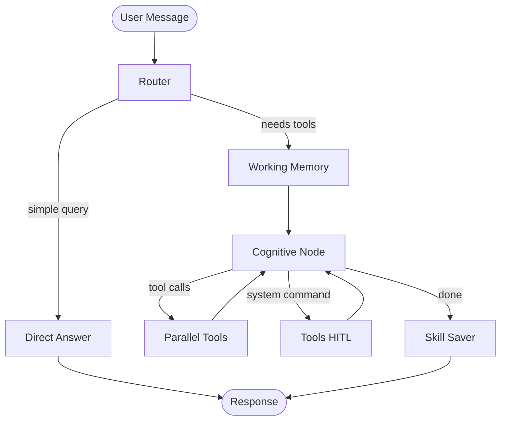

# OpenClaw

**OpenClaw** is an autonomous AI agent built on [LangGraph](https://github.com/langchain-ai/langgraph) and GPT-4o. It combines a conversational CLI, optional WhatsApp bridge, long- and short-term memory, a pluggable tool system, and scheduled background tasks into a single workspace-aware assistant.

The agent can read and write files, run shell commands (with human approval), execute Python in an E2B cloud sandbox, search the web, connect to external MCP servers, and learn reusable **skills** from successful code runs.

---

## Features

| Capability | Description |
|---|---|
| **LangGraph agent loop** | Router → direct answer or full agent path with parallel tool execution |
| **Human-in-the-loop (HITL)** | System shell commands require explicit approval in the CLI |
| **Short-term memory** | Token-budget management with summarization of older messages |
| **Long-term memory** | ChromaDB + Google embeddings; facts extracted from every user message |
| **E2B sandbox** | Isolated cloud Python execution for API calls, data work, and calculations |
| **Web search** | Tavily-powered search for up-to-date information |
| **MCP integration** | Hot-load tools from Model Context Protocol servers via `mcp_config.json` |
| **Dynamic skills** | Python scripts in `skills/` auto-register as LangChain tools |
| **Skill auto-save** | Successful sandbox code can be persisted as a new skill |
| **Scheduler** | Time-based tasks defined in `SCHEDULE.md` (file writes, scripts, notifications) |
| **Heartbeat** | Every 30 minutes, the agent triages the workspace using `HEARTBEAT.md` |
| **WhatsApp bridge** | FastAPI webhook server for text and voice messages |
| **Conversation persistence** | SQLite checkpointer stores graph state per session/thread |
| **Safety rollback** | Git-based workspace reset to last checkpoint |

---

## Architecture

OpenClaw is orchestrated as a LangGraph state machine. Incoming messages are classified, optionally compressed by working memory, then handled by either a lightweight direct LLM path or the full cognitive agent with tools.



### Core modules

| File | Role |
|---|---|
| `main.py` | CLI entry point, scheduler daemon, HITL approval loop |
| `agent_graph.py` | LangGraph workflow, LLM setup, routing logic |
| `tools_library.py` | Built-in tools, dynamic skill loader, `TOOLS.md` registry |
| `mcp_loader.py` | Async MCP client with sync wrappers for the agent |
| `mcp_config_loader.py` | Parses and validates `mcp_config.json` |
| `whatsapp_server.py` | FastAPI webhook bridge to Meta WhatsApp Cloud API |
| `config.py` | Paths, workspace seeding, daily logging |
| `memory/short_term.py` | Context window management and summarization |
| `memory/long_term.py` | ChromaDB memory extraction and retrieval |

### Workspace files

These Markdown files configure agent behavior without changing code:

| File | Purpose |
|---|---|
| `SOUL.md` | Agent identity, persona, and behavioral rules |
| `HEARTBEAT.md` | Prompt sent every 30 minutes for background workspace triage |
| `SCHEDULE.md` | Cron-style scheduled actions (`TIME \| action \| arg1 \| arg2`) |
| `TOOLS.md` | Auto-generated registry of all active tools (do not edit manually) |
| `mcp_config.json` | MCP server connection definitions |

---

## Project structure

```
claw/
├── main.py                 # CLI entry point
├── agent_graph.py          # LangGraph agent definition
├── tools_library.py        # Core + skill + MCP tools
├── mcp_loader.py           # MCP tool loader
├── mcp_config_loader.py    # MCP config parser
├── whatsapp_server.py      # WhatsApp webhook server
├── config.py               # Paths and workspace setup
├── memory/
│── short_term.py       # Working memory
│── long_term.py        # ChromaDB long-term memory
├── skills/                 # User-defined Python skills (auto-loaded)
├── logs/                   # Daily markdown activity logs
├── downloads/              # Files pulled from E2B sandbox
├── chroma_db/              # ChromaDB persistence (auto-created)
├── SOUL.md                 # Agent persona
├── HEARTBEAT.md            # Background triage prompt
├── SCHEDULE.md             # Scheduled tasks
├── TOOLS.md                # Auto-generated tool registry
├── mcp_config.json         # MCP server config
├── pyproject.toml          # Dependencies (uv/pip)
└── openclaw_state.db       # LangGraph SQLite checkpointer
```

---

## Requirements

- **Python 3.13+**
- **[uv](https://docs.astral.sh/uv/)** (recommended) or pip
- API keys for the services you plan to use (see [Environment variables](#environment-variables))

> **Note:** `config.py` sets `BASE_DIR` to an absolute path (`D:/claw`). Update this if you clone the project to a different location.

---

## Installation

1. **Clone the repository**

   ```bash
   git clone <https://github.com/alirazaaihub/personal-assistent.git>
   cd claw
   ```

2. **Install dependencies with uv**

   ```bash
   uv sync
   ```

   Or with pip:

   ```bash
   pip install -e .
   ```

3. **Create a `.env` file** in the project root (see below).

4. **First run** — `config.py` automatically seeds `SOUL.md`, `HEARTBEAT.md`, `SCHEDULE.md`, and `TOOLS.md` if they are missing.

---

## Environment variables

Create a `.env` file in the project root:

```env
# Required — GPT-4o via GitHub Models / Azure inference endpoint
GITHUB_TOKEN=your_github_token

# Required for long-term memory (Google embeddings)
GOOGLE_API_KEY=your_google_api_key

# Required for E2B sandbox execution
E2B_API_KEY=your_e2b_api_key

# Required for web search
TAVILY_API_KEY=your_tavily_api_key

# Optional — WhatsApp bridge (whatsapp_server.py)
WHATSAPP_TOKEN=your_meta_whatsapp_token
WHATSAPP_PHONE_NUMBER_ID=your_phone_number_id
VERIFY_TOKEN=your_webhook_verify_token
GROQ_API_KEY=your_groq_api_key
```

| Variable | Used by | Required for |
|---|---|---|
| `GITHUB_TOKEN` | `agent_graph.py` | CLI and WhatsApp agent (GPT-4o) |
| `GOOGLE_API_KEY` | `memory/long_term.py` | Long-term memory embeddings |
| `E2B_API_KEY` | `tools_library.py` | Sandbox Python execution |
| `TAVILY_API_KEY` | `tools_library.py` | `web_search` tool |
| `WHATSAPP_TOKEN` | `whatsapp_server.py` | Sending/receiving WhatsApp messages |
| `WHATSAPP_PHONE_NUMBER_ID` | `whatsapp_server.py` | WhatsApp Cloud API |
| `VERIFY_TOKEN` | `whatsapp_server.py` | Webhook verification with Meta |
| `GROQ_API_KEY` | `whatsapp_server.py` | Voice message transcription (Whisper) |

---

## Usage

### Interactive CLI

Start the main agent loop:

```bash
uv run main.py
```

**CLI commands**

| Command | Action |
|---|---|
| `exit` | Quit the agent |
| `new` | Start a fresh conversation session (new thread ID) |
| `flush` | Informational — memories persist automatically in ChromaDB |

When the agent requests a **system command** (`execute_system_command`), you will be prompted to approve or reject the operation before it runs.

### WhatsApp bridge

Start the FastAPI webhook server:

```bash
uv run whatsapp_server.py
```

Expose the server publicly (e.g. with ngrok or Cloudflare Tunnel) and register the webhook URL in the [Meta WhatsApp Cloud API](https://developers.facebook.com/docs/whatsapp/cloud-api) dashboard.

- Each WhatsApp number gets its own conversation thread.
- Safe tools run automatically; dangerous tools (`execute_system_command`, `safety_rollback`) are auto-denied for safety.
- Voice messages are transcribed via Groq Whisper before being sent to the agent.

Health check: `GET /` returns `{"status": "OpenClaw WhatsApp bridge is running"}`.

---

## Tools

### Built-in tools

| Tool | Description |
|---|---|
| `execute_python_in_sandbox` | Run Python in an E2B cloud sandbox |
| `download_from_sandbox` | Download a file from the sandbox to `downloads/` |
| `execute_system_command` | Run a shell command in the workspace (**HITL in CLI**) |
| `read_file` / `write_file` / `append_file` / `delete_file` | Workspace file operations (path-scoped to `BASE_DIR`) |
| `list_directory` | List workspace directory contents |
| `get_datetime` | Current system date and time |
| `web_search` | Tavily web search (top 5 results) |
| `safety_rollback` | Reset workspace to last Git checkpoint |
| `save_mcp_config` | Save and live-test MCP server configuration |

All file paths are validated to stay within the workspace root.

### Custom skills

Place standalone Python scripts in `skills/`. Each file is:

1. Syntax-checked at load time
2. Registered as a LangChain tool named after the file (e.g. `factorial_calculation.py` → `factorial_calculation`)
3. Executed via `python skills/<name>.py <args>`

Docstrings in skill files become the tool description shown to the agent.

After successful sandbox runs, the **Skill Saver** node can automatically extract and save reusable code into `skills/`.

### MCP servers

Configure external tools in `mcp_config.json`:

```json
{
  "mcpServers": {
    "context7": {
      "url": "https://mcp.context7.com/mcp",
      "transport": "streamable_http"
    },
    "my-local-server": {
      "command": "npx",
      "args": ["-y", "@some/mcp-server"],
      "transport": "stdio"
    }
  }
}
```

Supported transports: `stdio`, `streamable_http`, `sse`.

You can also paste MCP JSON in chat; the agent's `save_mcp_config` tool validates structure, tests live connections, and reloads tools.

---

## Memory system

### Short-term (working memory)

Before each agent turn, `memory/short_term.py` checks the token budget (~6,000 tokens). When usage exceeds 80% of the limit:

- Oversized messages are truncated
- Older, safe messages are summarized by the LLM
- Tool messages and unanswered tool-call pairs are protected from deletion

### Long-term (ChromaDB)

On every user message (background thread in `main.py`):

1. The LLM extracts explicit personal facts from the message
2. Facts are embedded with Google `embedding-001` and stored in ChromaDB
3. At query time, the top 5 relevant memories are injected into the system prompt

---

## Scheduler and heartbeat

### SCHEDULE.md

Define daily scheduled actions (one per line):

```
# Format: TIME | action | arg1 | arg2
10:00 PM | write_file | daily_hello.txt | Hello!
04:00 AM | notify | Good Morning!
08:30 | run_script | skills/my_task.py |
```

| Action | Description |
|---|---|
| `write_file` | Write `arg2` content to `arg1` path (relative to workspace) |
| `append_file` | Append `arg2` to `arg1` |
| `run_script` | Run `python arg1 arg2` |
| `notify` | Windows balloon notification with `arg1` as message |

Times accept `HH:MM` (24h) or `HH:MM AM/PM`. The scheduler reloads automatically when `SCHEDULE.md` is modified.

### HEARTBEAT.md

Every 30 minutes, the agent receives a **CRON PULSE** with the contents of `HEARTBEAT.md`. It performs workspace triage (e.g. checking skills and logs). A healthy workspace should respond with `HEARTBEAT_OK`; issues are logged to `logs/`.

---

## Logging

Activity is appended to daily markdown logs in `logs/YYYY-MM-DD.md`, including:

- Agent responses (direct and tool-augmented)
- Sandbox executions and shell commands
- File writes, web searches, MCP events
- WhatsApp traffic and cron alerts

---

## Security considerations

- **Path sandboxing** — File tools reject paths outside `BASE_DIR`.
- **HITL for shell commands** — `execute_system_command` interrupts the graph in CLI mode until you approve.
- **WhatsApp restrictions** — Dangerous tools are auto-denied on the WhatsApp channel.
- **MCP validation** — Configurations are structure-checked and connection-tested before being kept.
- **Git rollback** — `safety_rollback` resets the workspace to the last Git commit (initializes Git if needed).

Treat `.env`, API keys, and `openclaw_state.db` as sensitive. Do not commit secrets to version control.

---

## Tech stack

| Layer | Technology |
|---|---|
| Agent framework | LangGraph, LangChain |
| LLM | GPT-4o (GitHub Models / Azure inference) |
| Embeddings | Google Generative AI (`embedding-001`) |
| Vector store | ChromaDB |
| Checkpointing | SQLite (`langgraph-checkpoint-sqlite`) |
| Sandbox | E2B Code Interpreter |
| Web search | Tavily |
| WhatsApp | FastAPI + Meta Cloud API + Groq Whisper |
| Scheduling | `schedule` library |
| Package manager | uv |

---

## Development

Validate MCP config independently:

```bash
uv run python mcp_config_loader.py mcp_config.json
```

Customize agent behavior by editing `SOUL.md`. Add scheduled tasks in `SCHEDULE.md` and background checks in `HEARTBEAT.md`.

---

## License

No license file is included in this repository. Add one before public distribution.

---

## Acknowledgments

Built with [LangGraph](https://github.com/langchain-ai/langgraph), [LangChain](https://github.com/langchain-ai/langchain), [E2B](https://e2b.dev/), [Tavily](https://tavily.com/), and the [Model Context Protocol](https://modelcontextprotocol.io/).
